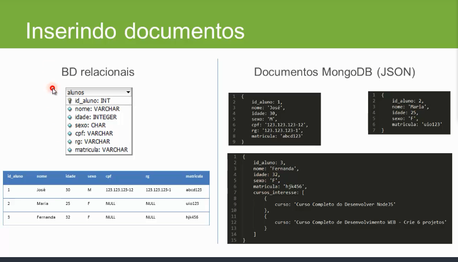
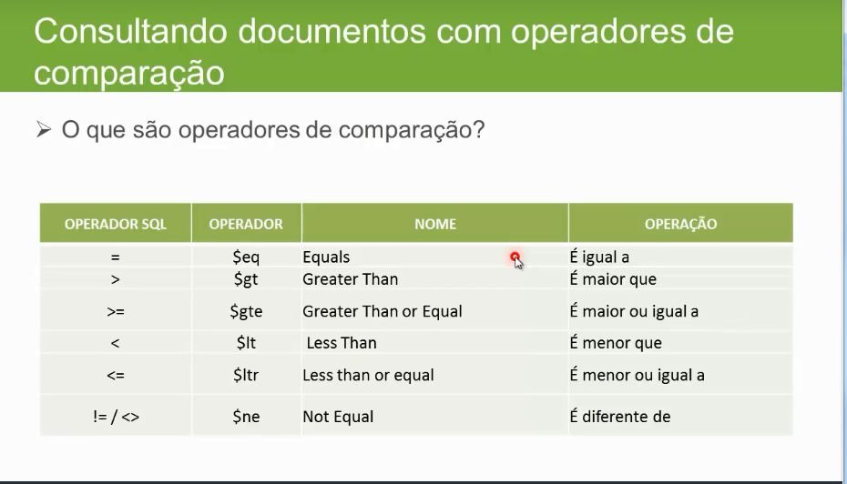

#Mongodb

local onde fica o mongodb

C:\Program Files\MongoDB\Server\4.0\bin


mongo.exe - acesso
mongod.exe - servidor

ctrl + shift botao direito, abrir prompt de comando aqui

inicia o mongod.exe primeiro
inicia o mongo.exe

##Exibindo criando e removendo banco de dados


exibir o banco de dados

    ```
        show dbs
    ```

selecionar/criar o banco de dados (o comando so cria a partir do momento que tem uma collection )
    ```
    use nomedoBanco
    ```


deletar um banco
entrar no banco
    ```
    use nomedoBanco
    db.dropDatabase()
    ```

##Exibindo criando e removendo coleções

- Criar uma collection

    ```
    db.createCollection("alunos")
    ```

- Para ver todas as collections no banco

    ```
    db.getCollectionNames()
    ```

- para remover uma collection 
    ```
    db.nomedacollection.drop()
    ```

##Inserindo documentos no mongo


BD RELACIONAIS VS MONGO DB


As collections não define uma estrutura como nas tabelas

Todo documento é auto contido e auto descritivo

Não tem uma estrutura rigida o que da flexibilidade 


Salvando os dados numa collection

    ´´´
        db.alunos.save({
            nome:'Jose',
            idade: 30,
            sexo: 'M',
            cpf: '123.123.123-12',
            rg: '123.123.123-1',
            matricula: abcd123
        })

        db.alunos.save({
            nome:'maria',
            idade: 25,
            sexo: 'F',
            matricula: aaa1234,
        })


        db.alunos.save({
            nome:'Fernanda',
            idade: 23,
            sexo: 'F',
            matricula: curso,
            cursos_interrese: [
                {curso: 'curso1'},
                {curso: 'curso2'}
            ]
        })
    ´´´


##consutando documentos


Tabela de compação



    ´´´
        show dbs
        use nome_do_banco
        db.getCollectionNames()
    ´´´

trazer o ultimo documento inserido dentro da collection

    ´´´
    db.alunos.findOne()
    ´´´


exibir todos os dados  da collection

    ´´´
    db.alunos.find()
    ´´´

exibir json formatado

    ´´´
    db.alunos.find().pretty()
    ´´´


###operadores

-Igual

nome = jose ($eq)
    
    ´´´
    db.alunos.find({nome:{$eq: "jose"}}).pretty()
    ´´´

-menor

idade < 30 ($lt)
    
    ´´´
    db.alunos.find({idade:{$lt: 30}}).pretty()

    ´´´
-menor ou igual

idade <= 30 ($lte)
    
    ´´´
    db.alunos.find({idade:{$lt: 30}}).pretty()
    ´´´


-maior

idade > 29  ($gt)
    
    ´´´
    db.alunos.find({idade:{$gt: 29}}).pretty()
    ´´´


-maior ou igual

idade >= 29  ($gt)
    
    ´´´
    db.alunos.find({idade:{$gte: 29}}).pretty()
    ´´´

-diferente

sexo != "M"  ($ne)
    
    ´´´
    db.alunos.find({sexo:{$ne: "F"}}).pretty()
    ´´´


##consultando documentos com operadores logicos

AND
OR

- and

sexo = f and idade < 25

    ´´´
        {
            sexo:{$eq: 'F'},
            idade: {$lt: 25}
        }

        db.alunos.find(
            {sexo:{$eq: "F"},
            {idade:{$lt: 25}
        }).pretty()
    ´´´


- or

nome = maria or nome =jose

    ´´´
      {
          $or:[
              {nome:{$eq: "maria"}},
              {nome:{$eq: "jose"}}
          ]
      }
    ´´´


## Atualizando documentos (update)


            update({parametros para atualização},{$set},{multi:false})

            $set =  o que alterar
            multi =  false so atualiza o primeiro
            multi =  true atuliza todos os  documentos


            o save busca o registo se encontrar ele substitui se nao ele inclui como um novo
            save(
                _id: xxxxxx
            )


- Update
um unico
    ´´´
    db.alunos.update({nome: 'jose'}, {$set:{nome 'joao'}})
    ´´´

varios
    ´´´
    db.alunos.update({nome: 'jose'}, {$set:{nome 'joao'}}, {multi: true})
    ´´´

- remocendo documentos

remove({criterio de exclusao}, 0 false ou 1 true})

0 remove todos os documentos
1 remove apenas o primeiro a aparecer


```
    db.alunos.remove({nome: 'maria'})
        o comando de cima é o mesmo do debaixo
    db.alunos.remove({nome:{$eq: 'maria'}})


    db.alunos.remove({idade:{$gt: 20}})
```